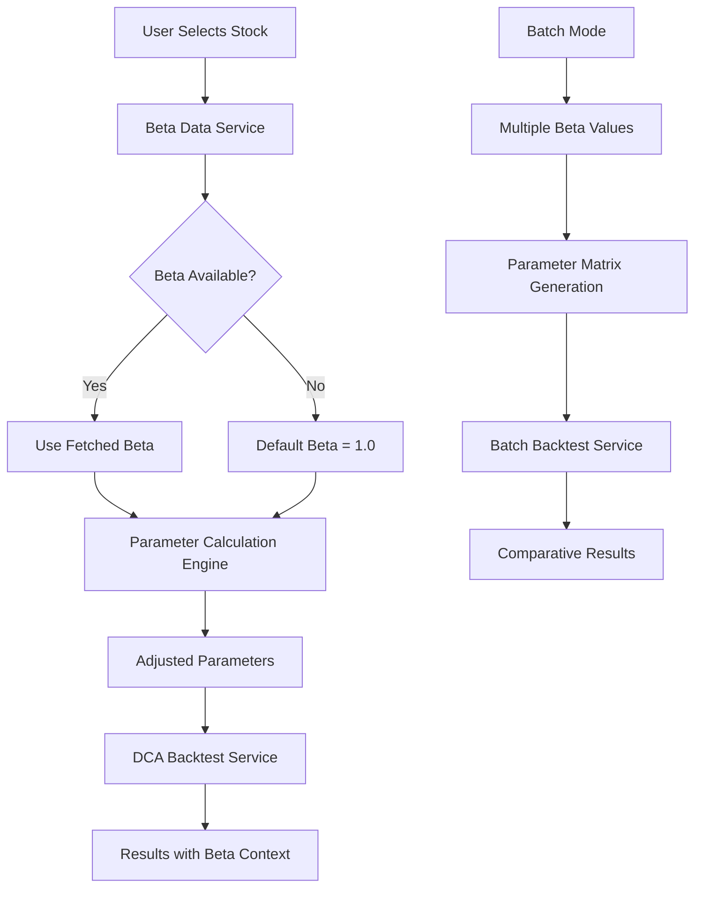

# Design Document

## Overview

The Beta-based parameter correlation feature enhances the DCA trading platform by automatically adjusting trading parameters based on a stock's volatility (Beta). This creates a more sophisticated risk-adjusted strategy that adapts to different stock characteristics, improving trading performance across various market conditions.

Beta represents a stock's volatility relative to the overall market (S&P 500), where:

- Beta = 1.0: Stock moves with the market
- Beta > 1.0: Stock is more volatile than the market
- Beta < 1.0: Stock is less volatile than the market

## Architecture

### Data Flow Architecture



### Service Layer Integration

The feature integrates with existing services:

- **StockDataService**: Extended to fetch Beta values
- **DCABacktestService**: Enhanced to accept Beta-adjusted parameters
- **BatchBacktestService**: Modified to handle Beta parameter ranges
- **Frontend Components**: Updated to display Beta information and controls

## Components and Interfaces

### 1. Beta Data Service

**Location**: `backend/services/betaDataService.js`

```javascript
class BetaDataService {
  async fetchBeta(symbol) {
    // Try multiple providers in order of preference
    // Returns: { beta: number, source: string, lastUpdated: date }
  }

  async getBetaFromYahooFinance(symbol) {
    // Primary source - Yahoo Finance API
  }

  async getBetaFromAlphaVantage(symbol) {
    // Fallback source - Alpha Vantage
  }

  async cacheBeta(symbol, betaData) {
    // Store Beta in database for future use
  }

  async getCachedBeta(symbol) {
    // Retrieve cached Beta from database
  }
}
```

### 2. Parameter Correlation Engine

**Location**: `backend/services/parameterCorrelationService.js`

```javascript
class ParameterCorrelationService {
  calculateBetaAdjustedParameters(baseBeta, targetBeta, baseParameters) {
    // Core correlation formulas:
    // profitRequirement = 0.05 * Beta
    // gridIntervalPercent = 0.1 * Beta
    // trailingBuyActivationPercent = 0.1 * Beta
    // trailingBuyReboundPercent = 0.05 * Beta
    // trailingSellActivationPercent = 0.2 * Beta
    // trailingSellPullbackPercent = 0.1 * Beta
  }

  validateParameterRanges(adjustedParameters) {
    // Ensure parameters stay within reasonable bounds
  }

  generateBetaParameterMatrix(betaValues, baseParameters) {
    // Generate all combinations for batch testing
  }
}
```

### 3. Enhanced Stock Data Service

**Modifications to**: `backend/services/stockDataService.js`

```javascript
// Add Beta fetching capability
async fetchAndStoreBeta(stockId, symbol) {
  const betaService = require('./betaDataService');
  const betaData = await betaService.fetchBeta(symbol);
  await database.insertBeta(stockId, betaData);
  return betaData;
}
```

### 4. Frontend Beta Controls

**New Component**: `frontend/src/components/BetaControls.js`

```javascript
const BetaControls = ({
  beta,
  onBetaChange,
  isManualOverride,
  onToggleManualOverride,
  showBetaScaling,
  onToggleBetaScaling,
}) => {
  // Beta display and manual override controls
  // Toggle for enabling/disabling Beta-based scaling
  // Visual indicators for adjusted vs. base parameters
};
```

## Data Models

### 1. Beta Data Model

**Database Table**: `stock_beta`

```sql
CREATE TABLE stock_beta (
  id INTEGER PRIMARY KEY AUTOINCREMENT,
  stock_id INTEGER NOT NULL,
  beta REAL NOT NULL,
  source TEXT NOT NULL,
  last_updated DATETIME NOT NULL,
  is_manual_override BOOLEAN DEFAULT FALSE,
  FOREIGN KEY (stock_id) REFERENCES stocks (id)
);
```

### 2. Enhanced Parameter Model

**Extended Configuration Object**:

```javascript
{
  // Existing parameters
  symbol: "TSLA",
  lotSizeUsd: 10000,
  maxLots: 10,

  // Beta-related additions
  beta: 1.5,
  betaSource: "yahoo_finance",
  betaLastUpdated: "2025-01-15T10:30:00Z",
  isManualBetaOverride: false,
  enableBetaScaling: true,

  // Base parameters (before Beta adjustment)
  baseProfitRequirement: 0.05,
  baseGridIntervalPercent: 0.1,

  // Calculated parameters (after Beta adjustment)
  profitRequirement: 0.075, // 0.05 * 1.5
  gridIntervalPercent: 0.15, // 0.1 * 1.5
  trailingBuyActivationPercent: 0.15, // 0.1 * 1.5
  trailingBuyReboundPercent: 0.075, // 0.05 * 1.5
  trailingSellActivationPercent: 0.3, // 0.2 * 1.5
  trailingSellPullbackPercent: 0.15 // 0.1 * 1.5
}
```

### 3. Batch Beta Configuration

**Extended Batch Parameters**:

```javascript
{
  parameterRanges: {
    symbols: ["TSLA", "NVDA", "AAPL"],
    betaValues: [0.25, 0.5, 1.0, 1.5, 2.0, 3.0],
    enableBetaScaling: true,

    // Base multipliers (used with Beta scaling)
    baseProfitRequirement: [0.05],
    baseGridIntervalPercent: [0.1],

    // OR manual parameter arrays (when Beta scaling disabled)
    profitRequirement: [0.03, 0.05, 0.07],
    gridIntervalPercent: [0.08, 0.1, 0.12]
  }
}
```

## Error Handling

### 1. Beta Data Fetching Errors

```javascript
// Graceful degradation strategy
try {
  beta = await betaService.fetchBeta(symbol);
} catch (error) {
  console.warn(`Beta fetch failed for ${symbol}: ${error.message}`);
  beta = { beta: 1.0, source: 'default', lastUpdated: new Date() };
}
```

### 2. Parameter Validation

```javascript
// Ensure parameters stay within reasonable bounds
function validateBetaAdjustedParameters(params) {
  const warnings = [];

  if (params.profitRequirement > 0.2) {
    warnings.push('Profit requirement exceeds 20% - consider manual override');
  }

  if (params.gridIntervalPercent > 0.5) {
    warnings.push('Grid interval exceeds 50% - may reduce trading frequency');
  }

  return { isValid: warnings.length === 0, warnings };
}
```

### 3. Data Provider Fallbacks

```javascript
// Multiple data source strategy
const betaProviders = [
  { name: 'yahoo_finance', priority: 1, rateLimit: null },
  { name: 'alpha_vantage', priority: 2, rateLimit: 25 },
  { name: 'cached', priority: 3, maxAge: 30 }, // 30 days
];
```

## Testing Strategy

### 1. Unit Tests

**Beta Data Service Tests**:

- Test Beta fetching from multiple providers
- Test caching and retrieval mechanisms
- Test fallback behavior when providers fail
- Test manual override functionality

**Parameter Correlation Tests**:

- Test Beta-based parameter calculations
- Test parameter validation and bounds checking
- Test batch parameter matrix generation
- Test edge cases (Beta = 0, negative Beta, extreme values)

### 2. Integration Tests

**End-to-End Beta Flow**:

- Test complete flow from stock selection to Beta-adjusted backtest
- Test batch mode with multiple Beta values
- Test manual override scenarios
- Test parameter persistence and restoration

### 3. Performance Tests

**Batch Testing Performance**:

- Test batch execution with 6 Beta values × 16 stocks = 96 combinations
- Measure Beta fetching performance and caching effectiveness
- Test concurrent Beta data fetching

### 4. Data Quality Tests

**Beta Data Validation**:

- Test Beta values against known benchmarks
- Test data freshness and update mechanisms
- Test handling of delisted or invalid symbols

## Implementation Phases

### Phase 1: Core Beta Infrastructure

1. Create BetaDataService with Yahoo Finance integration
2. Add Beta database schema and caching
3. Implement ParameterCorrelationService
4. Add unit tests for core functionality

### Phase 2: Single Mode Integration

1. Extend StockDataService to fetch Beta
2. Update DCABacktestService to accept Beta parameters
3. Create BetaControls frontend component
4. Update DCABacktestForm to show Beta information

### Phase 3: Batch Mode Enhancement

1. Extend BatchBacktestService for Beta parameter ranges
2. Update batch results display to show Beta context
3. Add Beta-based sorting and filtering
4. Implement batch Beta performance analysis

### Phase 4: Advanced Features

1. Add Beta trend analysis and alerts
2. Implement Beta-based portfolio optimization
3. Add Beta comparison charts and visualizations
4. Create Beta-based strategy recommendations

## API Endpoints

### New Endpoints

```javascript
// Get Beta for a stock
GET /api/stocks/:symbol/beta
Response: { beta: 1.5, source: "yahoo_finance", lastUpdated: "2025-01-15T10:30:00Z" }

// Update Beta manually
PUT /api/stocks/:symbol/beta
Body: { beta: 1.8, isManualOverride: true }

// Get Beta-adjusted parameters
POST /api/backtest/beta-parameters
Body: { beta: 1.5, baseParameters: {...} }
Response: { adjustedParameters: {...}, warnings: [] }

// Batch backtest with Beta ranges
POST /api/backtest/batch-beta
Body: { betaValues: [0.5, 1.0, 1.5], symbols: ["TSLA"], ... }
```

### Enhanced Endpoints

```javascript
// Enhanced single backtest (accepts Beta parameters)
POST /api/backtest/dca
Body: {
  symbol: "TSLA",
  beta: 1.5,
  enableBetaScaling: true,
  baseProfitRequirement: 0.05,
  // ... other parameters
}

// Enhanced batch backtest (includes Beta results)
POST /api/backtest/batch
Response: {
  results: [
    {
      parameters: { symbol: "TSLA", beta: 1.5, ... },
      betaAdjustedParameters: { profitRequirement: 0.075, ... },
      summary: { ... }
    }
  ]
}
```

## Security Considerations

1. **API Rate Limiting**: Implement caching to avoid excessive Beta API calls
2. **Data Validation**: Validate Beta values to prevent injection attacks
3. **Parameter Bounds**: Enforce reasonable limits on Beta-adjusted parameters
4. **User Input Sanitization**: Sanitize manual Beta override inputs

## Performance Optimizations

1. **Beta Caching**: Cache Beta values for 24 hours to reduce API calls
2. **Batch Beta Fetching**: Fetch multiple Betas concurrently
3. **Parameter Pre-calculation**: Pre-calculate common Beta parameter combinations
4. **Database Indexing**: Index Beta table by stock_id and last_updated

## Monitoring and Analytics

1. **Beta Data Quality Metrics**: Track Beta fetch success rates and data freshness
2. **Parameter Adjustment Impact**: Monitor how Beta adjustments affect backtest performance
3. **User Adoption Metrics**: Track usage of Beta features vs. manual parameters
4. **Performance Correlation**: Analyze correlation between Beta accuracy and strategy performance
