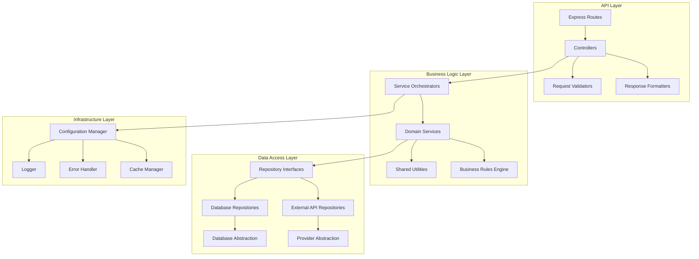

# Design Document

## Overview

This design document outlines a comprehensive refactoring strategy for the DCA Trading Platform to eliminate technical debt, reduce code duplication, and establish consistent architectural patterns. The refactoring will be conducted in phases to minimize risk while maintaining full functionality throughout the process.

Based on the codebase analysis, the following major issues have been identified:

- Significant code duplication between `dcaBacktestService.js` and `shortDCABacktestService.js`
- Inconsistent error handling and logging patterns across services
- Mixed concerns in service classes and API endpoints
- Lack of proper abstractions for data providers
- Inconsistent configuration management
- Limited test coverage and poor testability
- Frontend component duplication and inconsistent state management

## Architecture

### Current Architecture Issues

The current architecture suffers from several anti-patterns:

1. **Code Duplication**: Functions like `calculateMetrics`, `assessMarketCondition`, and `calculatePortfolioDrawdown` are duplicated across multiple services
2. **Tight Coupling**: Services directly instantiate dependencies rather than using dependency injection
3. **Mixed Responsibilities**: API endpoints contain business logic that should be in services
4. **Inconsistent Patterns**: Different services follow different architectural patterns
5. **Poor Testability**: Hard-coded dependencies make unit testing difficult

### Target Architecture

The refactored architecture will follow these principles:

1. **Layered Architecture**: Clear separation between API, Business Logic, and Data Access layers
2. **Dependency Injection**: Services receive dependencies through constructor injection
3. **Single Responsibility**: Each class/module has one clear purpose
4. **Interface Segregation**: Small, focused interfaces rather than large monolithic ones
5. **Open/Closed Principle**: Code open for extension but closed for modification



## Components and Interfaces

### 1. Shared Utilities Layer

**Purpose**: Eliminate code duplication by creating shared utility functions

**Components**:

- `MetricsCalculator`: Consolidates `calculateMetrics` functions from both DCA services
- `MarketAnalyzer`: Consolidates `assessMarketCondition` logic
- `DrawdownCalculator`: Consolidates drawdown calculation logic
- `PerformanceAnalyzer`: Shared performance calculation utilities

```javascript
// Example interface
interface IMetricsCalculator {
  calculatePortfolioMetrics(dailyValues, capitalDeployed, transactions, prices): PortfolioMetrics;
  calculateTradeMetrics(transactions, startDate, endDate): TradeMetrics;
  calculateDrawdown(portfolioValues): DrawdownMetrics;
}
```

### 2. Service Abstraction Layer

**Purpose**: Create consistent service interfaces and base classes

**Components**:

- `BaseBacktestService`: Abstract base class for all backtest services
- `IBacktestService`: Interface defining backtest service contract
- `ServiceContainer`: Dependency injection container
- `ServiceFactory`: Factory for creating service instances

```javascript
// Example base service
abstract class BaseBacktestService {
  constructor(
    protected metricsCalculator: IMetricsCalculator,
    protected marketAnalyzer: IMarketAnalyzer,
    protected logger: ILogger
  ) {}

  abstract runBacktest(params: BacktestParams): Promise<BacktestResult>;

  protected validateParams(params: BacktestParams): ValidationResult {
    // Shared validation logic
  }
}
```

### 3. Data Provider Abstraction

**Purpose**: Standardize data provider interfaces and implement proper fallback mechanisms

**Components**:

- `IDataProvider`: Common interface for all data providers
- `DataProviderManager`: Manages provider selection and fallback
- `ProviderHealthChecker`: Monitors provider availability
- `DataCache`: Caches provider responses

```javascript
interface IDataProvider {
  name: string;
  isAvailable(): Promise<boolean>;
  fetchDailyPrices(symbol: string, options?: FetchOptions): Promise<PriceData[]>;
  fetchFundamentals(symbol: string): Promise<FundamentalData>;
}
```

### 4. Configuration Management

**Purpose**: Centralize and standardize configuration handling

**Components**:

- `ConfigurationManager`: Central configuration management
- `EnvironmentValidator`: Validates required environment variables
- `ConfigurationSchema`: Defines configuration structure and defaults

```javascript
class ConfigurationManager {
  private config: ApplicationConfig;

  constructor() {
    this.config = this.loadAndValidateConfig();
  }

  get<T>(key: string): T;
  getRequired<T>(key: string): T;
  validate(): ValidationResult;
}
```

### 5. Error Handling and Logging

**Purpose**: Implement consistent error handling and logging across the application

**Components**:

- `ApplicationError`: Base error class with error codes and context
- `ErrorHandler`: Centralized error handling and formatting
- `Logger`: Structured logging with consistent formats
- `ErrorRecovery`: Automatic error recovery mechanisms

```javascript
class ApplicationError extends Error {
  constructor(
    message: string,
    public code: string,
    public context?: any,
    public recoverable: boolean = false
  ) {
    super(message);
  }
}
```

### 6. Database Access Layer

**Purpose**: Implement consistent data access patterns

**Components**:

- `IRepository<T>`: Generic repository interface
- `BaseRepository<T>`: Base repository implementation
- `TransactionManager`: Database transaction management
- `QueryBuilder`: Type-safe query building

```javascript
interface IRepository<T> {
  findById(id: string): Promise<T | null>;
  findAll(criteria?: SearchCriteria): Promise<T[]>;
  create(entity: T): Promise<T>;
  update(id: string, updates: Partial<T>): Promise<T>;
  delete(id: string): Promise<void>;
}
```

### 7. Frontend Component Architecture

**Purpose**: Eliminate component duplication and establish consistent patterns

**Components**:

- `BaseComponent`: Common component functionality
- `useBacktest`: Custom hook for backtest operations
- `useApi`: Custom hook for API calls with error handling
- `ComponentLibrary`: Reusable UI components

```javascript
// Custom hook example
function useBacktest() {
  const [loading, setLoading] = useState(false);
  const [error, setError] = useState(null);
  const [data, setData] = useState(null);

  const runBacktest = useCallback(async params => {
    // Standardized backtest execution logic
  }, []);

  return { loading, error, data, runBacktest };
}
```

## Data Models

### Standardized Data Transfer Objects

```javascript
// Backtest Parameters
interface BacktestParams {
  symbol: string;
  startDate: string;
  endDate: string;
  lotSizeUsd: number;
  maxLots: number;
  gridSizePercent: number;
  trailingStopPercent: number;
  // ... other parameters
}

// Backtest Result
interface BacktestResult {
  summary: BacktestSummary;
  metrics: PerformanceMetrics;
  transactions: Transaction[];
  dailyValues: DailyValue[];
  chartData: ChartData;
}

// Error Response
interface ErrorResponse {
  error: true;
  code: string;
  message: string;
  details?: any;
  timestamp: string;
}
```

## Error Handling

### Error Classification System

1. **Business Logic Errors**: Invalid parameters, business rule violations
2. **Data Access Errors**: Database connection issues, query failures
3. **External Service Errors**: API provider failures, network issues
4. **System Errors**: Memory issues, file system errors
5. **Validation Errors**: Input validation failures

### Error Recovery Strategies

```javascript
class ErrorRecoveryManager {
  async handleError(error: ApplicationError, context: ErrorContext): Promise<RecoveryResult> {
    switch (error.code) {
      case 'DATA_PROVIDER_UNAVAILABLE':
        return this.tryFallbackProvider(context);
      case 'DATABASE_CONNECTION_LOST':
        return this.retryWithBackoff(context);
      case 'INVALID_PARAMETERS':
        return this.suggestCorrections(error, context);
      default:
        return this.logAndPropagate(error, context);
    }
  }
}
```

## Testing Strategy

### Test Architecture

1. **Unit Tests**: Test individual functions and classes in isolation
2. **Integration Tests**: Test service interactions and data flow
3. **Contract Tests**: Test API contracts and interfaces
4. **End-to-End Tests**: Test complete user workflows

### Test Coverage Goals

- **Critical Business Logic**: 95% coverage
- **Service Layer**: 90% coverage
- **Data Access Layer**: 85% coverage
- **API Endpoints**: 90% coverage
- **Utility Functions**: 95% coverage

### Testing Infrastructure

```javascript
// Test utilities
class TestDataBuilder {
  static createBacktestParams(overrides?: Partial<BacktestParams>): BacktestParams;
  static createPriceData(symbol: string, days: number): PriceData[];
  static createMockProvider(responses: MockResponse[]): IDataProvider;
}

// Test fixtures
class TestFixtures {
  static readonly SAMPLE_PRICE_DATA = [...];
  static readonly VALID_BACKTEST_PARAMS = {...};
  static readonly ERROR_SCENARIOS = [...];
}
```

### Refactoring Safety Net

1. **Characterization Tests**: Capture current behavior before refactoring
2. **Golden Master Tests**: Compare outputs before and after refactoring
3. **Property-Based Tests**: Test invariants that should hold across refactoring
4. **Regression Test Suite**: Comprehensive test suite to catch regressions

## Implementation Phases

### Phase 1: Foundation (Weeks 1-2)

- Set up testing infrastructure
- Create shared utility functions
- Implement configuration management
- Establish error handling patterns

### Phase 2: Service Layer Refactoring (Weeks 3-4)

- Create service abstractions
- Refactor DCA backtest services
- Implement dependency injection
- Add comprehensive service tests

### Phase 3: Data Layer Standardization (Weeks 5-6)

- Implement repository pattern
- Refactor data providers
- Add data access tests
- Implement caching layer

### Phase 4: API Layer Cleanup (Weeks 7-8)

- Refactor API endpoints
- Implement consistent response formats
- Add API validation
- Create API documentation

### Phase 5: Frontend Refactoring (Weeks 9-10)

- Create reusable components
- Implement custom hooks
- Standardize state management
- Add component tests

### Phase 6: Performance and Optimization (Weeks 11-12)

- Optimize database queries
- Implement caching strategies
- Add performance monitoring
- Conduct load testing

## Migration Strategy

### Backward Compatibility

1. **API Versioning**: Maintain v1 APIs while introducing v2
2. **Feature Flags**: Gradually roll out refactored components
3. **Database Migrations**: Incremental schema changes
4. **Configuration Migration**: Automatic config format updates

### Risk Mitigation

1. **Blue-Green Deployment**: Deploy to staging environment first
2. **Canary Releases**: Gradual rollout to production
3. **Rollback Plan**: Quick rollback procedures for each phase
4. **Monitoring**: Enhanced monitoring during migration

### Success Metrics

1. **Code Quality**: Reduced cyclomatic complexity, improved maintainability index
2. **Test Coverage**: Achieve target coverage percentages
3. **Performance**: Maintain or improve response times
4. **Reliability**: Reduce error rates and improve uptime
5. **Developer Experience**: Faster development cycles, easier debugging
