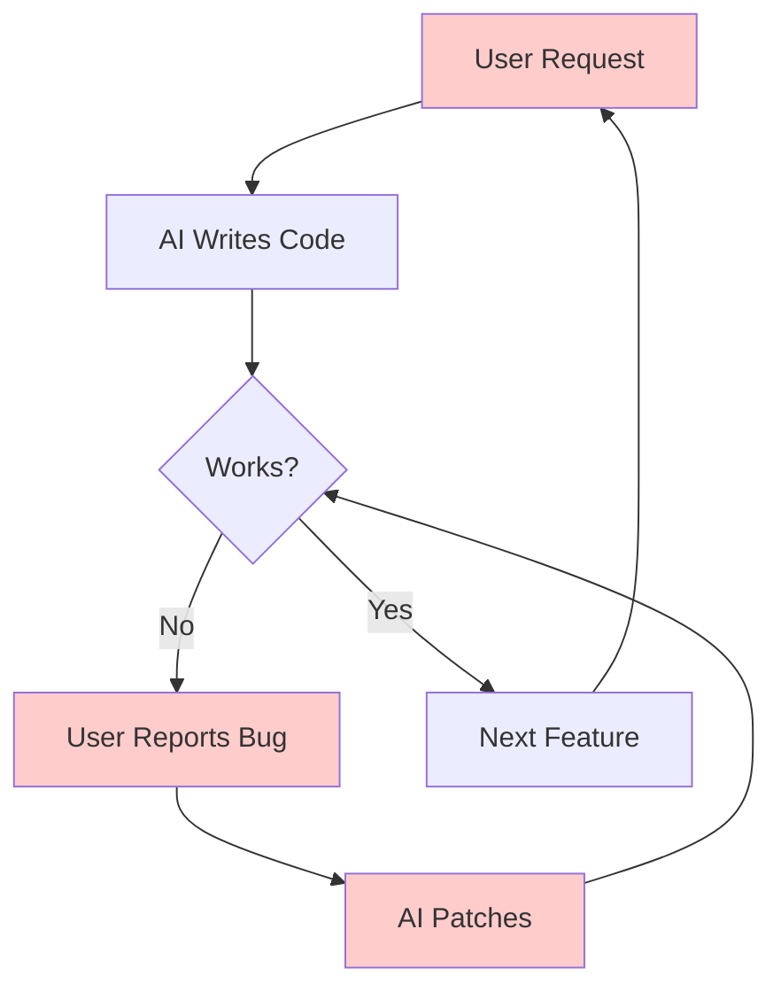
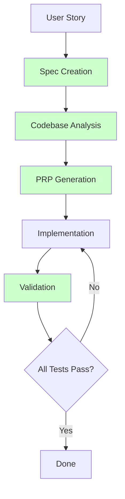
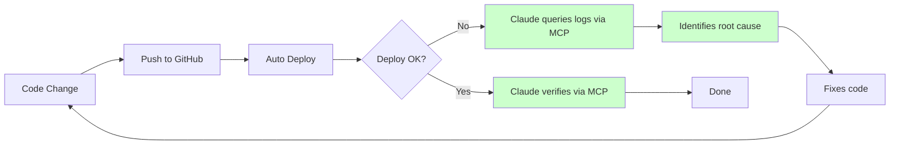
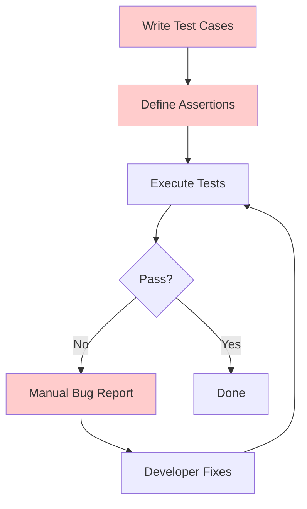
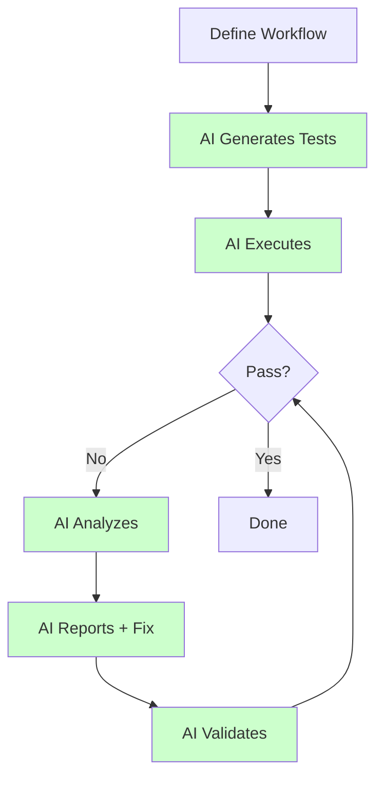
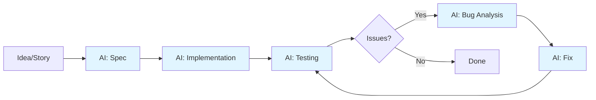

<style>
/* Larger fonts for better readability - skip cover slide */
.slidev-layout:not(.cover) {
  font-size: 1.1em;
}
.slidev-layout:not(.cover) pre {
  font-size: 0.95em;
}
.slidev-layout:not(.cover) code {
  font-size: 0.95em;
}
.slidev-layout:not(.cover) ul,
.slidev-layout:not(.cover) ol {
  font-size: 1.05em;
}
.slidev-layout:not(.cover) li {
  margin: 0.4rem 0;
  line-height: 1.5;
}
.slidev-layout:not(.cover) h2 {
  font-size: 1.4em;
  margin-top: 0.8rem;
}
.slidev-layout:not(.cover) table {
  font-size: 0.95em;
}
</style>
---

# Context Engineering with AI Coding Agents

From "Vibe Coding" to Structured Development

<div class="pt-8">
  <span class="opacity-80">Building Complex Systems with Claude Code</span>
</div>

<div class="abs-br m-6 text-sm opacity-50">
  Grid-Based DCA Trading Case Study | 2025
</div>

---
layout: default
---

# The Evolution of AI-Assisted Development

<v-clicks>

## Prompt Engineering Era (2022-2023)
- Chat-based interactions
- Single-shot queries
- Limited context retention

## Context Engineering Era (2024-2025)
- Structured context documents (CLAUDE.md, specs)
- Persistent project knowledge
- Multi-agent orchestration
- Self-improving workflows

</v-clicks>

---

# What is "Vibe Coding"?

<v-clicks>

## The Pattern
```
User: "Add a button that does X"
AI: *writes code*
User: "That broke Y, fix it"
AI: *patches code*
User: "Now Z doesn't work..."
AI: *patches again*
```

## Characteristics
- Ad-hoc prompts without structure
- No persistent project context
- Reactive bug fixing
- Linear conversation → Context loss
- Repeated explanations required

</v-clicks>

---

# What is "Context Engineering"?

<v-clicks>

## The Pattern
```
1. Define requirements in specification document
2. Agent analyzes codebase for patterns
3. Agent creates implementation plan (PRP)
4. Execution with built-in validation
5. Systematic testing and verification
```

## Characteristics
- Structured context documents persist across sessions
- AI understands project architecture
- Proactive pattern recognition
- Self-validating implementations
- Reusable workflows and skills

</v-clicks>

---
layout: two-cols
---

# Flow: Vibe Coding



**Problems:**
- Circular bug fixes
- Lost context
- No pattern reuse

::right::

# Flow: Context Engineering



**Benefits:**
- Front-loaded analysis
- Built-in validation
- Reusable patterns

---

# The Context Engineering Stack

<v-clicks>

## Layer 1: Project Context (CLAUDE.md)
- Project-wide instructions and conventions
- Testing commands and workflows

## Layer 2: Specifications (.kiro/specs/)
- Requirements, design, and task documents
- Kiro-style numbered directories

## Layer 3: Execution Protocols (PRPs)
- Product Requirement Prompts
- Context-rich implementation plans

## Layer 4: Skills & Commands (.claude/)
- Reusable workflow automations
- Domain-specific expertise

## Layer 5: MCP Servers (External Integration)
- Connect to deployment platforms (Render)
- Access databases, APIs, external services

</v-clicks>

---

# CLAUDE.md: The Project Brain

```markdown
# Claude Instructions

## Core Principles
- Validate user requests first
- Be critical and faithful to the truth
- Act as a partner, not a yes-man

## Problem and Bug Handling
1. Root Cause Analysis & Comprehensive Fixing
2. Thorough Testing & Verification
3. Debugging Strategy
4. Task Management with TodoWrite

## Testing Commands
- Backend: curl -X POST http://localhost:3001/api/...
- Frontend: npm test
```

**Purpose**: Persistent instructions that survive context resets

---

# Specifications: Kiro-Style Structure

```
.kiro/specs/
├── 01_algo-performance-calculation/
│   ├── requirements.md
│   ├── design.md
│   └── tasks.md
├── 22_trailing-stop-order-type/
│   ├── requirements.md
│   ├── design.md
│   └── tasks.md
└── 60_metrics-calculation-standardization/
    ├── requirements.md
    ├── design.md
    └── tasks.md
```

<v-click>

**Convention**: `##_kebab-case-name`
- Zero-padded numbers (01, 02... 10, 11)
- Sequential ordering
- Self-documenting history

</v-click>

---

# Anatomy of a Specification

<div class="grid grid-cols-3 gap-2 text-sm">

<div>

### requirements.md
- Business requirements
- Functional requirements
- Use cases
- Acceptance criteria
- Success metrics

</div>

<div>

### design.md
- Architecture decisions
- Data flow diagrams
- API contracts
- Component structure

</div>

<div>

### tasks.md
- Implementation steps
- Validation commands
- Progress checkboxes
- Dependencies

</div>

</div>

<v-click>

```markdown
## Acceptance Criteria
### AC-1: Limit Order Mode (Default)
GIVEN a trailing stop buy with trailingStopOrderType=limit
WHEN price drops 10% (activation) and rebounds 5%
AND price exceeds the peak reference
THEN order is CANCELLED
```

</v-click>

---

# PRPs: Product Requirement Prompts

<v-clicks>

## Origin
Created by **Rasmus Widing** ([github.com/Wirasm/PRPs-agentic-eng](https://github.com/Wirasm/PRPs-agentic-eng))

## Definition
> "PRD + curated codebase intelligence + agent/runbook—the minimum viable packet an AI needs to plausibly ship production-ready code on the first pass."

## Key Difference from PRDs
| PRD | PRP |
|-----|-----|
| Human-readable specs | AI-optimized context |
| General requirements | Precise file paths |
| Assumes dev context | Includes code examples |
| Manual validation | Executable validation loops |

</v-clicks>

---

# PRP Structure

```markdown
# PRP: Feature Name

## Goal
Single sentence describing the desired outcome

## Why
Business justification and user value

## Context
- Relevant file paths with line numbers
- Existing patterns to follow
- External library documentation

## Implementation Blueprint
1. CREATE: src/services/newFeature.js
   - Follow pattern from existingFeature.js:45-80
2. UPDATE: src/App.js
   - Add route configuration
3. ADD: tests/newFeature.test.js

## Validation Loop
- [ ] npm test passes
- [ ] curl -X POST localhost:3001/api/new returns 200
- [ ] UI displays correctly
```

---

# Custom Skills: Domain Expertise

```
.claude/skills/
├── bug-investigator/SKILL.md
├── comprehensive-fixer/SKILL.md
├── backtest-tester/SKILL.md
├── spec-generator/SKILL.md
└── g01-parameter-adder/SKILL.md
```

<v-click>

## Example: Bug Investigator Skill
```markdown
# When to Use
- User reports a bug with a frontend URL
- Unexpected behavior in backtest results
- API endpoints returning wrong data

# Investigation Workflow
1. Capture Real Backend API Call
2. Create Reproducible Test Script
3. Run Test and Capture Evidence
4. Document Evidence
5. Trace Code Execution
6. Create Bug Report
```

</v-click>

---

# Slash Commands: Quick Actions

```
.claude/commands/
├── development/
│   ├── smart-commit.md
│   ├── new-dev-branch.md
│   └── create-pr.md
├── prp-commands/
│   ├── prp-story-create.md
│   ├── prp-story-execute.md
│   └── prp-spec-create.md
└── code-quality/
    ├── review-general.md
    └── refactor-simple.md
```

<v-click>

**Usage**: `/prp-story-create Add user authentication`

The command triggers a multi-phase workflow:
1. Story decomposition
2. Codebase intelligence gathering
3. Pattern recognition
4. Task generation
5. Validation design

</v-click>

---

# MCP: Model Context Protocol

Connecting Claude to External Services

<v-clicks>

## What is MCP?
Protocol for connecting AI agents to external services and data sources

## Key Capability
Claude can **directly access** real-world systems during development:
- Query deployment status
- Read production logs
- Check environment variables
- Trigger redeployments

## Available MCP Servers
- **Render** - Deployment platform
- **GitHub** - Repository and PR management
- **PostgreSQL** - Database queries
- **Yahoo Finance** - Live stock data

</v-clicks>

---

# Case Study: Render MCP Integration

Real-Time Deployment Monitoring

## The Problem (Before MCP)
```
Developer: "Is the deployment done?"
*Opens Render dashboard*
*Navigates to service*
*Clicks on deploys tab*
*Scrolls through logs*
"Ah, there's an error on line 247..."
```

<v-click>

## The Solution (With MCP)
```
Developer: "Check the deployment status"
Claude: *queries Render MCP*
Claude: "Deploy failed at 2:34pm. Error in server.js:247 -
         missing environment variable BACKEND_URL.
         Should I add it and redeploy?"
```

</v-click>

---

# Render MCP Capabilities

<v-clicks>

## Deployment Operations
- List all services and their status
- View recent deployments and logs
- Monitor build progress in real-time
- Trigger new deployments

## Environment Management
- Read environment variables
- Update configurations
- Compare local vs production

## Metrics & Monitoring
- CPU and memory usage
- Request counts and latency
- Active database connections

## Database Access
- Run read-only SQL queries
- Debug data issues directly
- No SSH required

</v-clicks>

---

# MCP Development Workflow



<v-click>

**Key Benefit**: Claude monitors and troubleshoots deployments without manual dashboard navigation

</v-click>

---

# Other MCP Integrations

<v-clicks>

## Yahoo Finance MCP
- Live stock prices and beta values
- Historical data on-demand
- No API rate limit management

## GitHub MCP
- Search repository history
- Reference past implementations
- Create PRs and issues

## Database MCP
- Query production SQLite safely (read-only)
- Debug data issues without SSH
- Verify data integrity

## Key Insight
> Claude accesses specialized knowledge on-demand, reducing hallucinations with grounded, real-world data

</v-clicks>

---

# The Tools Landscape (2025)

| Tool | Type | Strengths | Limitations |
|------|------|-----------|-------------|
| **Claude Code** | CLI Agent | Context files, MCP, Skills | Terminal-based |
| **Cursor** | IDE | Inline editing, codebase indexing | Less extensible |
| **GitHub Copilot** | Extension | Widespread, inline completion | Limited reasoning |
| **Kiro IDE** | IDE | Spec-driven, steering | AWS-focused |
| **Gemini CLI** | CLI | Google models, web search | Newer ecosystem |
| **Codex** | API/CLI | OpenAI ecosystem | Less agentic |

---

# Why Claude Code for Context Engineering?

<v-clicks>

## 1. Persistent Context Files
- CLAUDE.md loaded every session
- No re-explaining project setup

## 2. MCP (Model Context Protocol)
- Connect to external tools (Render, databases)
- Real-time deployment monitoring

## 3. Extensible Skills System
- Create domain-specific expertise
- Reusable across projects

## 4. Subagent Architecture
- Parallel task execution
- Specialized agents for different tasks

## 5. TodoWrite Integration
- Built-in task management
- Progress tracking

</v-clicks>

---

# Real-World Impact: Grid-Based DCA Trading

<v-clicks>

## By the Numbers
- **60+ specifications** created and implemented
- **30+ parameters** across three modes (single, portfolio, batch)
- **6 custom skills** for domain-specific workflows
- **25+ PRP commands** for different task types

## Development Velocity
- Complex features implemented in hours, not days
- Bugs traced to root cause systematically
- Zero manual testing required (curl-based verification)

## Quality Improvements
- Consistent code patterns across codebase
- Self-documenting through specifications
- Regression prevention through validation loops

</v-clicks>

---

# Case Study: Adding a Parameter

<div class="text-sm">

## Traditional Approach
1. Developer researches where parameter should go
2. Updates backend service
3. Updates frontend form
4. Updates URL handling
5. Tests manually
6. Finds missed spot, patches
7. Repeat until done

## Context Engineering Approach
1. `/prp-story-create Add trailingStopOrderType parameter`
2. PRP analyzes codebase, identifies all touch points
3. Generates spec with validation commands
4. Execute with built-in verification
5. Done in one pass

</div>

<v-click>

**Result**: 4 hours → 45 minutes

</v-click>

---

# The G01 Multi-Mode Compliance Skill

```markdown
# g01-parameter-adder/SKILL.md

## Purpose
Add new parameters that work across all three modes:
- Single backtest
- Portfolio backtest
- Batch backtest

## Checklist (auto-generated todos)
- [ ] Add to backend service
- [ ] Add to frontend form component
- [ ] Add to URL parameter manager
- [ ] Add to batch request payload
- [ ] Add to portfolio service
- [ ] Update API documentation
- [ ] Add validation tests
```

---

# Testing Strategy: No Manual Testing

<v-clicks>

## The Principle
> "If you can test with curl and get logs, do it yourself—don't ask the user"

## Implementation
```bash
# Create reproducible test script
curl -X POST http://localhost:3001/api/backtest/dca \
  -H "Content-Type: application/json" \
  -d '{"symbol": "PLTR", "startDate": "2024-01-01", ...}' \
  | jq '.data.metrics'

# Extract transaction logs for debugging
node -e "
const data = require('/tmp/response.json');
data.data.transactionLog.forEach(l => console.log(l));
"
```

## Benefits
- Reproducible test cases saved for regression
- AI can iterate without user involvement
- Clear verification URLs for every fix

</v-clicks>

---

# Debugging Workflow


<v-click>

## Key Insight
Don't fix the symptom—trace to root cause, find similar issues, fix comprehensively

</v-click>

---

# Multi-Agent Orchestration

<v-clicks>

## Parallel Research
```javascript
Task agent 1: "Analyze backend implementation"
Task agent 2: "Analyze frontend components"
Task agent 3: "Find related test files"
Task agent 4: "Check documentation"
```

## Parallel Testing
```javascript
Task agent 1: "Test single mode with various params"
Task agent 2: "Test batch mode combinations"
Task agent 3: "Test edge cases"
Task agent 4: "Verify URL persistence"
```

## Benefits
- 4x faster information gathering
- Comprehensive coverage
- Independent failure isolation

</v-clicks>

---

# Evolving Patterns

<v-clicks>

## What's Working
- Spec-driven development scales well
- Skills capture and preserve domain expertise
- PRPs enable one-pass implementations
- MCP connections enable real deployment workflows

## What's Emerging
- Better subagent communication patterns
- More sophisticated validation loops
- Cross-project skill sharing
- Automated skill improvement based on usage

## What's Next
- Visual diagramming in specifications
- Automated performance regression testing
- Multi-model collaboration (Opus for reasoning, Haiku for speed)

</v-clicks>

---

# Testing: Traditional vs AI-Driven

<div class="grid grid-cols-2 gap-4">

<div>

## Traditional Test Case Approach
```
1. Write test cases manually
2. Define expected outputs
3. Execute test suite
4. Compare actual vs expected
5. File bug reports
6. Fix bugs
7. Re-run tests
```

**Limitations:**
- Time-consuming test writing
- Brittle test maintenance
- Test coverage gaps
- Manual effort intensive

</div>

<div>

## AI-Driven Workflow Approach
```
1. Define testing workflow (natural language)
2. AI generates test scenarios
3. AI executes tests autonomously
4. AI analyzes results
5. AI files detailed bug reports
6. AI suggests fixes
7. AI validates fixes
```

**Benefits:**
- **10x faster test authoring** (vs manual)
- Self-healing tests
- Comprehensive coverage
- Autonomous iteration
- **72.3% adoption in 2024** (TechTarget survey)

</div>

</div>

---
layout: two-cols
---

# Testing Flow: Traditional



**Manual Steps:**
- Test case authoring
- Bug report writing
- Context switching

::right::

# Testing Flow: AI-Driven



**Automated Steps:**
- Test generation
- Execution & analysis
- Fix validation

---

# Systematic Refinement: Development Pipeline

<v-clicks>

## The Concept
Instead of one-shot prompting, use **staged AI collaboration** through progressive refinement

## The Pipeline



## Key: Each Stage Has Full Context
- Spec informs implementation
- Implementation informs testing
- Test results inform fixes
- **Progressive refinement, not one-shot**

<div class="text-sm text-gray-400 mt-8">
📚 Research validation:<br>
• IEEE/ACM 2024: "Effectiveness of AI Pair Programming in Systematic Software Development"<br>
• Springer 2024: "Staged Refinement Approaches in AI-Assisted Development"<br>
• Industry adoption: 72.3% of development teams using AI testing (TechTarget 2024)
</div>

</v-clicks>

---

# AI as Your Co-Founder

<v-clicks>

## Mindset Shift: From Tool to Partner

**Traditional View:**
- AI = code completion tool
- Give instructions, get code
- Transactional interaction

**Co-Founder View:**
- AI = technical co-founder / CTO
- Bounce ideas, iterate together
- Strategic collaboration

## What This Enables

- **Architecture discussions**: "Should we use microservices or monolith?"
- **Trade-off analysis**: "What are pros/cons of this approach?"
- **Alternative exploration**: "What are 3 other ways to solve this?"
- **Technical decisions**: "Which database fits our scaling needs?"

## The Conversation Flow
```
You: "I want to build X for Y users"
AI: "Here are 3 architectural approaches, let's discuss..."
You: "Option 2 looks good, but concerned about Z"
AI: "Valid concern. Here's how to mitigate..."
```

</v-clicks>

---
layout: center
class: text-center
---

# AI Development Requires Human Oversight

<br>

<div class="text-left mx-auto max-w-4xl">

<v-clicks>

## ⚠️ Important Caveats

**AI-generated code requires validation:**
- ✅ AI writes code 10x faster
- ❌ AI doesn't guarantee correctness
- ✅ AI suggests test cases comprehensively
- ❌ AI may miss edge cases humans catch

**Hybrid approach is most effective:**
- AI handles boilerplate, repetitive tasks
- Human provides domain expertise, critical thinking
- Code review remains essential
- Testing validates AI output

**From research:**
- Teams using AI + human review: 40% faster delivery, high quality
- Teams using AI without review: 50% faster initial code, 30% more bugs

</v-clicks>

</div>

<v-click>

<br>

<div class="text-center text-xl text-blue-400">
AI is a copilot, not an autopilot.
</div>

</v-click>

---

# The CLI Advantage

<v-clicks>

## Why CLI > GUI for AI Development

**Traditional GUI:**
- Click, point, scroll
- Context switching
- Limited by UI design
- Constrained workflows

**CLI + Natural Language:**
- Direct command execution
- Stays in flow state
- Unlimited expressiveness
- Custom workflows
- **70% of developers prefer CLI** for complex tasks (2024 survey)

## Natural Language: The Ultimate Interface

> You don't need to learn the tool's language. The tool learns yours.

**Examples:**
```
"Deploy the latest changes to production"
"Show me all failing tests"
"Create a backup before this refactor"
"Analyze performance bottlenecks in auth service"
```

</v-clicks>

<v-click>

## 🚀 AI-Powered CLI Tools (2024)

- **GitHub Copilot CLI**: Natural language → git, gh, shell commands
- **Gemini CLI**: Google's AI assistant for terminal
- **Warp AI**: AI-powered terminal with natural language queries
- **Fig**: Autocomplete + AI suggestions for CLI

**Trend**: Moving from "learn 500 commands" → "describe what you want"

</v-click>

<v-clicks>

## Claude Code Enables This
- Understands full project context
- Executes complex multi-step workflows
- Integrates with any CLI tool
- Extends via custom commands

</v-clicks>

---

# Rethinking Project Management

<v-clicks>

## Do You Still Need Jira?

**Traditional PM Tools:**
- Create tickets manually
- Update status fields
- Write acceptance criteria
- Track in kanban boards

**AI-Native Approach:**
```bash
# Instead of opening Jira:
"Create implementation plan for user auth feature"
→ AI generates spec, tasks, acceptance criteria

"What's the status of bug #42?"
→ AI checks git history, test results, deployment status

"Show me all P1 bugs"
→ AI queries codebase, logs, recent issues
```

## The Shift
From **data entry in PM tools** to **natural language task management**

- Specs live in codebase (.kiro/specs/)
- Tasks auto-generated from specs
- Status derived from git + CI/CD
- TodoWrite for real-time tracking

## Still Useful: Team Coordination
Jira remains valuable for:
- Cross-team visibility
- Stakeholder reporting
- Enterprise compliance

But for **individual developer workflow**: CLI + AI > GUI clicks

</v-clicks>

---

# Getting Started

<v-clicks>

## 1. Create CLAUDE.md
```markdown
# Claude Instructions
## Project: Your Project Name
## Commands
- Test: npm test
- Lint: npm run lint
```

## 2. Structure Your Specs
```
.kiro/specs/01_first-feature/
├── requirements.md
├── design.md
└── tasks.md
```

## 3. Add Domain Skills
```
.claude/skills/your-skill/SKILL.md
```

## 4. Create Workflow Commands
```
.claude/commands/your-command.md
```

</v-clicks>

---

# Key Takeaways

<v-clicks>

1. **Context > Prompts**: Structured context files beat clever prompts

2. **Front-load Analysis**: Spec creation catches issues before code

3. **Self-Validating**: Every task should have executable verification

4. **Capture Expertise**: Skills preserve and scale domain knowledge

5. **Systematic Debugging**: Root cause analysis prevents symptom-chasing

6. **Parallel Execution**: Multi-agent orchestration accelerates work

7. **Evolving System**: Skills and specs improve with each use

</v-clicks>

---
layout: center
class: text-center
---

# Questions?

<div class="pt-8">

**Resources**

[PRPs Repository](https://github.com/Wirasm/PRPs-agentic-eng) by Rasmus Widing

[Claude Code Documentation](https://docs.anthropic.com/claude-code)

[Grid-Based DCA Trading Demo](https://dca-backtest-frontend.onrender.com)

</div>

---

# Appendix: Specification Example

<div class="text-xs">

```markdown
# Requirements: Trailing Stop Order Type Parameter

## Business Requirements
### BR-1: Order Type Selection
- Users must choose between "limit" and "market" order types
- Default: "limit" (preserves current behavior)

## Functional Requirements
### FR-1: Parameter Definition
- Name: trailingStopOrderType
- Type: String (enum)
- Values: "limit" | "market"
- Validation: Must be one of allowed values

## Acceptance Criteria
### AC-1: Limit Order Mode
GIVEN a trailing stop buy with trailingStopOrderType=limit
WHEN price exceeds the peak reference
THEN order is CANCELLED

### AC-2: Market Order Mode
GIVEN a trailing stop buy with trailingStopOrderType=market
WHEN price exceeds the peak reference
THEN order EXECUTES at current market price
```

</div>

---

# Appendix: Skill Template

```markdown
---
name: your-skill-name
description: When to use this skill
version: 1.0.0
---

# Skill Name

## When to Use
- Condition 1
- Condition 2

## Workflow

### Step 1: First Action
Details and commands

### Step 2: Second Action
Details and commands

## Important Notes
- Note 1
- Note 2

## After Completion
Next steps or related skills
```

---

# Appendix: PRP Command Structure

```markdown
---
description: "Short description for command list"
---

# Command Name

## Mission
What this command accomplishes

## Phase 1: Analysis
Steps for initial analysis

## Phase 2: Research
Codebase intelligence gathering

## Phase 3: Generation
Output creation steps

## Quality Criteria
- [ ] Checklist item 1
- [ ] Checklist item 2

## Output
Where to save the result
```
