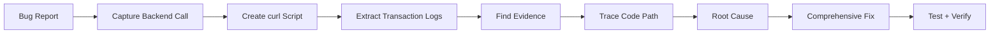

# Context Engineering with AI Coding Agents

From "Vibe Coding" to Structured Development

<div class="pt-8">
  <span class="opacity-80">Building Complex Systems with Claude Code</span>
</div>

<div class="abs-br m-6 text-sm opacity-50">
  DCA Backtest Tool Case Study | 2025
</div>

---
layout: default
---

# The Evolution of AI-Assisted Development

<v-clicks>

## Prompt Engineering Era (2022-2023)
- Chat-based interactions
- Single-shot queries
- Limited context retention

## Context Engineering Era (2024-2025)
- Structured context documents (CLAUDE.md, specs)
- Persistent project knowledge
- Multi-agent orchestration
- Self-improving workflows

</v-clicks>

---

# What is "Vibe Coding"?

<v-clicks>

## The Pattern
```
User: "Add a button that does X"
AI: *writes code*
User: "That broke Y, fix it"
AI: *patches code*
User: "Now Z doesn't work..."
AI: *patches again*
```

## Characteristics
- Ad-hoc prompts without structure
- No persistent project context
- Reactive bug fixing
- Linear conversation → Context loss
- Repeated explanations required

</v-clicks>

---

# What is "Context Engineering"?

<v-clicks>

## The Pattern
```
1. Define requirements in specification document
2. Agent analyzes codebase for patterns
3. Agent creates implementation plan (PRP)
4. Execution with built-in validation
5. Systematic testing and verification
```

## Characteristics
- Structured context documents persist across sessions
- AI understands project architecture
- Proactive pattern recognition
- Self-validating implementations
- Reusable workflows and skills

</v-clicks>

---
layout: two-cols
---

# Flow: Vibe Coding


**Problems:**
- Circular bug fixes
- Lost context
- No pattern reuse

::right::

# Flow: Context Engineering


**Benefits:**
- Front-loaded analysis
- Built-in validation
- Reusable patterns

---

# The Context Engineering Stack

<v-clicks>

## Layer 1: Project Context (CLAUDE.md)
- Project-wide instructions and conventions
- Testing commands and workflows
- Permission boundaries

## Layer 2: Specifications (.kiro/specs/)
- Requirements documents
- Design documents
- Task checklists

## Layer 3: Execution Protocols (PRPs)
- Product Requirement Prompts
- Context-rich implementation plans
- Validation commands

## Layer 4: Skills & Commands (.claude/)
- Reusable workflow automations
- Domain-specific expertise
- Custom slash commands

</v-clicks>

---

# CLAUDE.md: The Project Brain

```markdown
# Claude Instructions

## Core Principles
- Validate user requests first
- Be critical and faithful to the truth
- Act as a partner, not a yes-man

## Problem and Bug Handling
1. Root Cause Analysis & Comprehensive Fixing
2. Thorough Testing & Verification
3. Debugging Strategy
4. Task Management with TodoWrite

## Testing Commands
- Backend: curl -X POST http://localhost:3001/api/...
- Frontend: npm test
```

**Purpose**: Persistent instructions that survive context resets

---

# Specifications: Kiro-Style Structure

```
.kiro/specs/
├── 01_algo-performance-calculation/
│   ├── requirements.md
│   ├── design.md
│   └── tasks.md
├── 22_trailing-stop-order-type/
│   ├── requirements.md
│   ├── design.md
│   └── tasks.md
└── 60_metrics-calculation-standardization/
    ├── requirements.md
    ├── design.md
    └── tasks.md
```

<v-click>

**Convention**: `##_kebab-case-name`
- Zero-padded numbers (01, 02... 10, 11)
- Sequential ordering
- Self-documenting history

</v-click>

---

# Anatomy of a Specification

<div class="grid grid-cols-3 gap-2 text-sm">

<div>

### requirements.md
- Business requirements
- Functional requirements
- Use cases
- Acceptance criteria
- Success metrics

</div>

<div>

### design.md
- Architecture decisions
- Data flow diagrams
- API contracts
- Component structure

</div>

<div>

### tasks.md
- Implementation steps
- Validation commands
- Progress checkboxes
- Dependencies

</div>

</div>

<v-click>

```markdown
## Acceptance Criteria
### AC-1: Limit Order Mode (Default)
GIVEN a trailing stop buy with trailingStopOrderType=limit
WHEN price drops 10% (activation) and rebounds 5%
AND price exceeds the peak reference
THEN order is CANCELLED
```

</v-click>

---

# PRPs: Product Requirement Prompts

<v-clicks>

## Origin
Created by **Rasmus Widing** ([github.com/Wirasm/PRPs-agentic-eng](https://github.com/Wirasm/PRPs-agentic-eng))

## Definition
> "PRD + curated codebase intelligence + agent/runbook—the minimum viable packet an AI needs to plausibly ship production-ready code on the first pass."

## Key Difference from PRDs
| PRD | PRP |
|-----|-----|
| Human-readable specs | AI-optimized context |
| General requirements | Precise file paths |
| Assumes dev context | Includes code examples |
| Manual validation | Executable validation loops |

</v-clicks>

---

# PRP Structure

```markdown
# PRP: Feature Name

## Goal
Single sentence describing the desired outcome

## Why
Business justification and user value

## Context
- Relevant file paths with line numbers
- Existing patterns to follow
- External library documentation

## Implementation Blueprint
1. CREATE: src/services/newFeature.js
   - Follow pattern from existingFeature.js:45-80
2. UPDATE: src/App.js
   - Add route configuration
3. ADD: tests/newFeature.test.js

## Validation Loop
- [ ] npm test passes
- [ ] curl -X POST localhost:3001/api/new returns 200
- [ ] UI displays correctly
```

---

# Custom Skills: Domain Expertise

```
.claude/skills/
├── bug-investigator/SKILL.md
├── comprehensive-fixer/SKILL.md
├── backtest-tester/SKILL.md
├── spec-generator/SKILL.md
└── g01-parameter-adder/SKILL.md
```

<v-click>

## Example: Bug Investigator Skill
```markdown
# When to Use
- User reports a bug with a frontend URL
- Unexpected behavior in backtest results
- API endpoints returning wrong data

# Investigation Workflow
1. Capture Real Backend API Call
2. Create Reproducible Test Script
3. Run Test and Capture Evidence
4. Document Evidence
5. Trace Code Execution
6. Create Bug Report
```

</v-click>

---

# Slash Commands: Quick Actions

```
.claude/commands/
├── development/
│   ├── smart-commit.md
│   ├── new-dev-branch.md
│   └── create-pr.md
├── prp-commands/
│   ├── prp-story-create.md
│   ├── prp-story-execute.md
│   └── prp-spec-create.md
└── code-quality/
    ├── review-general.md
    └── refactor-simple.md
```

<v-click>

**Usage**: `/prp-story-create Add user authentication`

The command triggers a multi-phase workflow:
1. Story decomposition
2. Codebase intelligence gathering
3. Pattern recognition
4. Task generation
5. Validation design

</v-click>

---

# The Tools Landscape (2025)

| Tool | Type | Strengths | Limitations |
|------|------|-----------|-------------|
| **Claude Code** | CLI Agent | Context files, MCP, Skills | Terminal-based |
| **Cursor** | IDE | Inline editing, codebase indexing | Less extensible |
| **GitHub Copilot** | Extension | Widespread, inline completion | Limited reasoning |
| **Kiro IDE** | IDE | Spec-driven, steering | AWS-focused |
| **Gemini CLI** | CLI | Google models, web search | Newer ecosystem |
| **Codex** | API/CLI | OpenAI ecosystem | Less agentic |

---

# Why Claude Code for Context Engineering?

<v-clicks>

## 1. Persistent Context Files
- CLAUDE.md loaded every session
- No re-explaining project setup

## 2. MCP (Model Context Protocol)
- Connect to external tools (Render, databases)
- Real-time deployment monitoring

## 3. Extensible Skills System
- Create domain-specific expertise
- Reusable across projects

## 4. Subagent Architecture
- Parallel task execution
- Specialized agents for different tasks

## 5. TodoWrite Integration
- Built-in task management
- Progress tracking

</v-clicks>

---

# Real-World Impact: DCA Backtest Tool

<v-clicks>

## By the Numbers
- **60+ specifications** created and implemented
- **30+ parameters** across three modes (single, portfolio, batch)
- **6 custom skills** for domain-specific workflows
- **25+ PRP commands** for different task types

## Development Velocity
- Complex features implemented in hours, not days
- Bugs traced to root cause systematically
- Zero manual testing required (curl-based verification)

## Quality Improvements
- Consistent code patterns across codebase
- Self-documenting through specifications
- Regression prevention through validation loops

</v-clicks>

---

# Case Study: Adding a Parameter

<div class="text-sm">

## Traditional Approach
1. Developer researches where parameter should go
2. Updates backend service
3. Updates frontend form
4. Updates URL handling
5. Tests manually
6. Finds missed spot, patches
7. Repeat until done

## Context Engineering Approach
1. `/prp-story-create Add trailingStopOrderType parameter`
2. PRP analyzes codebase, identifies all touch points
3. Generates spec with validation commands
4. Execute with built-in verification
5. Done in one pass

</div>

<v-click>

**Result**: 4 hours → 45 minutes

</v-click>

---

# The G01 Multi-Mode Compliance Skill

```markdown
# g01-parameter-adder/SKILL.md

## Purpose
Add new parameters that work across all three modes:
- Single backtest
- Portfolio backtest
- Batch backtest

## Checklist (auto-generated todos)
- [ ] Add to backend service
- [ ] Add to frontend form component
- [ ] Add to URL parameter manager
- [ ] Add to batch request payload
- [ ] Add to portfolio service
- [ ] Update API documentation
- [ ] Add validation tests
```

---

# Testing Strategy: No Manual Testing

<v-clicks>

## The Principle
> "If you can test with curl and get logs, do it yourself—don't ask the user"

## Implementation
```bash
# Create reproducible test script
curl -X POST http://localhost:3001/api/backtest/dca \
  -H "Content-Type: application/json" \
  -d '{"symbol": "PLTR", "startDate": "2024-01-01", ...}' \
  | jq '.data.metrics'

# Extract transaction logs for debugging
node -e "
const data = require('/tmp/response.json');
data.data.transactionLog.forEach(l => console.log(l));
"
```

## Benefits
- Reproducible test cases saved for regression
- AI can iterate without user involvement
- Clear verification URLs for every fix

</v-clicks>

---

# Debugging Workflow



<v-click>

## Key Insight
Don't fix the symptom—trace to root cause, find similar issues, fix comprehensively

</v-click>

---

# Multi-Agent Orchestration

<v-clicks>

## Parallel Research
```javascript
Task agent 1: "Analyze backend implementation"
Task agent 2: "Analyze frontend components"
Task agent 3: "Find related test files"
Task agent 4: "Check documentation"
```

## Parallel Testing
```javascript
Task agent 1: "Test single mode with various params"
Task agent 2: "Test batch mode combinations"
Task agent 3: "Test edge cases"
Task agent 4: "Verify URL persistence"
```

## Benefits
- 4x faster information gathering
- Comprehensive coverage
- Independent failure isolation

</v-clicks>

---

# Evolving Patterns

<v-clicks>

## What's Working
- Spec-driven development scales well
- Skills capture and preserve domain expertise
- PRPs enable one-pass implementations
- MCP connections enable real deployment workflows

## What's Emerging
- Better subagent communication patterns
- More sophisticated validation loops
- Cross-project skill sharing
- Automated skill improvement based on usage

## What's Next
- Visual diagramming in specifications
- Automated performance regression testing
- Multi-model collaboration (Opus for reasoning, Haiku for speed)

</v-clicks>

---

# Getting Started

<v-clicks>

## 1. Create CLAUDE.md
```markdown
# Claude Instructions
## Project: Your Project Name
## Commands
- Test: npm test
- Lint: npm run lint
```

## 2. Structure Your Specs
```
.kiro/specs/01_first-feature/
├── requirements.md
├── design.md
└── tasks.md
```

## 3. Add Domain Skills
```
.claude/skills/your-skill/SKILL.md
```

## 4. Create Workflow Commands
```
.claude/commands/your-command.md
```

</v-clicks>

---

# Key Takeaways

<v-clicks>

1. **Context > Prompts**: Structured context files beat clever prompts

2. **Front-load Analysis**: Spec creation catches issues before code

3. **Self-Validating**: Every task should have executable verification

4. **Capture Expertise**: Skills preserve and scale domain knowledge

5. **Systematic Debugging**: Root cause analysis prevents symptom-chasing

6. **Parallel Execution**: Multi-agent orchestration accelerates work

7. **Evolving System**: Skills and specs improve with each use

</v-clicks>

---
layout: center
class: text-center
---

# Questions?

<div class="pt-8">

**Resources**

[PRPs Repository](https://github.com/Wirasm/PRPs-agentic-eng) by Rasmus Widing

[Claude Code Documentation](https://docs.anthropic.com/claude-code)

[DCA Backtest Tool Demo](https://dca-backtest-frontend.onrender.com)

</div>

---

# Appendix: Specification Example

<div class="text-xs">

```markdown
# Requirements: Trailing Stop Order Type Parameter

## Business Requirements
### BR-1: Order Type Selection
- Users must choose between "limit" and "market" order types
- Default: "limit" (preserves current behavior)

## Functional Requirements
### FR-1: Parameter Definition
- Name: trailingStopOrderType
- Type: String (enum)
- Values: "limit" | "market"
- Validation: Must be one of allowed values

## Acceptance Criteria
### AC-1: Limit Order Mode
GIVEN a trailing stop buy with trailingStopOrderType=limit
WHEN price exceeds the peak reference
THEN order is CANCELLED

### AC-2: Market Order Mode
GIVEN a trailing stop buy with trailingStopOrderType=market
WHEN price exceeds the peak reference
THEN order EXECUTES at current market price
```

</div>

---

# Appendix: Skill Template

```markdown
---
name: your-skill-name
description: When to use this skill
version: 1.0.0
---

# Skill Name

## When to Use
- Condition 1
- Condition 2

## Workflow

### Step 1: First Action
Details and commands

### Step 2: Second Action
Details and commands

## Important Notes
- Note 1
- Note 2

## After Completion
Next steps or related skills
```

---

# Appendix: PRP Command Structure

```markdown
---
description: "Short description for command list"
---

# Command Name

## Mission
What this command accomplishes

## Phase 1: Analysis
Steps for initial analysis

## Phase 2: Research
Codebase intelligence gathering

## Phase 3: Generation
Output creation steps

## Quality Criteria
- [ ] Checklist item 1
- [ ] Checklist item 2

## Output
Where to save the result
```
